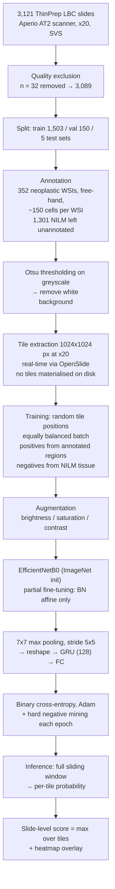

# Paper Notes — A Deep Learning Model for Cervical Cancer Screening on Liquid-Based Cytology Specimens in Whole Slide Images

> Kanavati, F.; Hirose, N.; Ishii, T.; Fukuda, A.; Ichihara, S.; Tsuneki, M.
> *Cancers* **2022**, 14(5), 1159. DOI: [10.3390/cancers14051159](https://doi.org/10.3390/cancers14051159) · PMID: 35267466
> Open access: <https://pmc.ncbi.nlm.nih.gov/articles/PMC8909106/>

---

## 1. Summary

### 1.1 Motivation

Cervical cancer is still a leading cause of cancer death in women (342,000 deaths worldwide in 2020). Screening programs have reduced mortality, but conventional cytology screening carries structural limitations:

- **Moderate interobserver reproducibility** — the authors cite a kappa of 0.46 for conventional cytology.
- **High false-negative rates**, reported as reaching up to 50%.
- **Human resource constraints** — manual screening is labor-intensive, and liquid-based cytology (LBC), while it improved specimen quality, did not remove the manual screening burden.

Whole Slide Imaging makes the specimen available as a digital image, which opens the door to computer-assisted screening.

### 1.2 Objective

> "The goal of this study was to investigate the use of a deep learning model for the classification of WSIs of LBC specimens into neoplastic and non-neoplastic."

The task is therefore **binary at the slide level**: neoplastic vs. NILM. Sub-classification into the individual Bethesda categories is explicitly out of scope.

### 1.3 What makes the setting notable

- The specimens are **ThinPrep liquid-based cytology**, digitized as WSIs — the same material type as our own project.
- The scale is large for this domain: **3,121 slides collected**, from a real clinical laboratory routine.
- Supervision is **weak and sparse**: only coarse free-hand annotations on the neoplastic slides, no annotation at all on the NILM slides, and the final decision is produced per slide, not per cell.
- The authors describe the work as **a pilot study**.

### 1.4 Availability

Neither the **dataset** nor the **code/weights** were released. The dataset is described as unavailable publicly due to institutional privacy requirements, obtainable from the corresponding author under a data use agreement.

---

## 2. Pipeline

### 2.1 Data — source and acquisition

| Item | Value |
|---|---|
| Specimen type | Liquid-based cytology, **ThinPrep** Pap test (Hologic, Inc.) |
| Origin | A private clinical laboratory in Japan |
| Slides collected | 3,121 |
| Excluded for poor scan quality | 32 |
| Slides analyzed | **3,089** |
| Scanner | Aperio AT2 (Leica Microsystems, Osaka, Japan) — the same scanner for all WSIs |
| Magnification | ×20 |
| File format | SVS with JPEG2000 compression |

### 2.2 Data — labels

The positive class ("neoplastic") aggregates several diagnostic categories:

`ASC` (atypical squamous cell) · `LSIL` · `HSIL` · `CIS` (carcinoma in situ) · `ADC` (adenocarcinoma) · `SCC` (squamous cell carcinoma)

The negative class is `NILM`. The model never predicts the individual categories — they are collapsed into a single positive label.

### 2.3 Data — splits

| Set | Total | Neoplastic | NILM |
|---|---|---|---|
| Training | 1,503 | 302 | 1,201 |
| Validation | 150 | 50 | 100 |
| Test — Full Agreement | 300 | 20 | 280 |
| Test — Equal Balance | 750 | 375 | 375 |
| Test — Equal Balance (Reviewed) | 643 | 279 | 364 |
| Test — Clinical Balance | 750 | 38 | 712 |
| Test — Clinical Balance (Reviewed) | 525 | 35 | 490 |

How the test sets were designed — this is one of the more interesting methodological choices of the paper:

- **Full Agreement** — only cases whose diagnoses were fully agreed upon by two independent cytoscreeners in different institutes. The cleanest possible ground truth.
- **Clinical Balance** — approximates the real screening distribution, roughly **95% NILM / 5% neoplastic**.
- **Equal Balance** — an artificial **50/50** split.
- **Reviewed variants** — built *from* the Clinical Balance and Equal Balance sets: two independent cytoscreeners reviewed every case and the ones they disagreed on were removed. They are therefore **subsets of their parent sets**, not independent test sets, which is why their sizes are smaller (643 from 750, 525 from 750).

The point of this design is that the difference in performance between a set and its reviewed counterpart isolates how much of the apparent error is actually **label noise from interobserver disagreement** rather than model failure.

### 2.4 Annotation

- Performed by **senior cytoscreeners and pathologists** who do routine cytopathological screening in general hospitals and clinical laboratories in Japan.
- **352 neoplastic WSIs** from the training sets were annotated — matching the 302 training + 50 validation neoplastic slides.
- The **1,301 NILM WSIs remained unannotated** (1,201 training + 100 validation) — their slide-level negative label is sufficient, since any tile from them is a valid negative.
- Annotations were **coarse, obtained by free-hand drawing**, targeting neoplastic cells based on representative neoplastic epithelial cell morphology: increased nuclear/cytoplasmic ratio, abnormalities of nuclear shape, hyperchromatism, irregular chromatin distribution, and prominent nucleolus.
- On average, **~150 cells (or cellular clusters) were annotated per WSI**.
- **Tool:** an in-house online tool built by customizing the open-source OpenSeadragon viewer.
- **Quality control:** annotations were modified if necessary, confirmed and verified by a senior cytoscreener.
- **Cost:** the average annotation time was **about one hour per WSI**.

### 2.5 Preprocessing and tile extraction

1. **Background removal** — Otsu's method applied to the greyscale version of the WSI, to eliminate the white background. This is the only offline preprocessing step described; it defines the tissue regions from which tiles may be taken.
2. **Tile size** — **1024 × 1024 px**, for both training and inference.
3. **Working magnification** — ×20, the native scanner magnification; no downsampling to a lower level is described.

**Tiles are never materialised on disk.** The paper states that tile extraction was performed *"in real-time using the OpenSlide library"*, i.e. tiles are read on demand from the SVS file during training and inference, exploiting OpenSlide's random region access. Given the size of a WSI, the pool of possible tile positions is effectively continuous rather than a fixed finite dataset — which is exactly why the hard mining step (§2.10) operates on a *sampling probability* instead of reordering a fixed tile set.

**Where the sliding window applies.** The regular grid with a **512 × 512 px stride** (half the tile size, 50% overlap) is described specifically for *inference*: "To perform inference on a WSI, we used a sliding window approach with a fixed-size stride of 512 × 512 px". It is therefore used in two places — final inference on a slide, and the full sweep over the NILM WSIs at the end of each epoch for hard mining. **Training does not use this grid**; training tiles are taken at random positions (see §2.6).

The 1024 × 1024 tile size is justified on clinical grounds rather than computational ones: it was chosen "to allow a larger view", based on cytologists' input that they usually need to see the **neighbouring cells around a given cell** in order to diagnose accurately.

### 2.6 Training tile sampling

This is where the weak supervision is handled. Tile **positions are random**, not grid-aligned:

- **Positive tiles** — extracted randomly from the annotated regions of neoplastic WSIs, with the constraint that at least one annotated cell is visible anywhere inside the 1024 × 1024 tile.
- **Negative tiles** — extracted randomly from anywhere in the tissue regions of NILM WSIs.
- **Batch composition** — positive and negative tiles were interleaved so that each training batch was **equally balanced**, despite the underlying slide-level imbalance.

An epoch is therefore a fixed sampling budget over a virtually unbounded pool of tile positions, not a full pass over an enumerated tile dataset.

`not reported`: the number of tiles sampled per WSI per epoch, and the batch size.

### 2.7 Data augmentation

Real-time augmentation applied to the extracted tiles during training, limited to **photometric transformations**:

- brightness
- saturation
- contrast

No geometric augmentation (flips, rotations, scaling) is reported.

### 2.8 Model architecture

| Component | Detail |
|---|---|
| CNN backbone | **EfficientNetB0** |
| Input size | Modified to **1024 × 1024 px** (instead of the standard EfficientNet input) |
| Initialization | **ImageNet pre-trained weights** |
| Pooling on CNN output | **7 × 7 max pooling with stride 5 × 5** |
| Sequence model | Output of the CNN is reshaped and fed to an **RNN with a gated recurrent unit (GRU), size 128** |
| Head | Fully connected layer |
| RNN initialization | Random weights |

The CNN acts as a feature extractor over a large tile; the max pooling reduces its spatial feature map, and the reshaped result is consumed by the GRU as a sequence, so the RNN aggregates evidence across sub-regions **within a single tile** before the final classification.

### 2.9 Training configuration

| Item | Value |
|---|---|
| Loss | Binary cross-entropy |
| Optimizer | Adam (β₁ = 0.9, β₂ = 0.999) |
| Learning rate | 0.001, with decay of **0.95 every 2 epochs** |
| Fine-tuning strategy | **Partial fine-tuning** — only the affine weights of the batch normalization layers of the CNN are updated; all remaining CNN weights stay frozen. The GRU and head are trained from scratch. |
| Early stopping | Training stopped automatically when the validation loss showed no further improvement for **10 epochs** |
| Model selection | The model with the **lowest validation loss** |
| Framework | TensorFlow |

`not reported`: batch size, total number of epochs/iterations, hardware/GPUs.

### 2.10 Hard negative mining

At the **end of each epoch**, full sliding-window inference was run on **all the NILM WSIs**, and the random sampling probability was adjusted so that **false-positively predicted NILM tiles became more likely to be sampled** in the next epoch.

This is the mechanism that compensates for the fact that NILM slides are unannotated: instead of choosing informative negatives by hand, the model's own false positives are recycled as the hard negatives.

### 2.11 Inference and slide-level aggregation

1. **Full sliding-window inference** over the WSI with the same 1024 × 1024 tiles and 512 px stride, producing a probability of being neoplastic for **every tile**.
2. **Aggregation** — the slide-level probability is the **maximum probability over all tiles** of that WSI.
3. **Visualization** — the per-tile predictions form a grid over all areas containing cells, which is rendered as a **heatmap of probabilities superimposed on the WSI**.

Max-pooling over tiles is the natural aggregation here: a single confidently neoplastic region is enough to make the whole slide positive, which mirrors how a screening decision is actually made.

`not reported`: inference time per slide, or any computational cost measurement.

---

## 3. Final results

### 3.1 Slide-level performance (with 95% confidence intervals)

| Test set | ROC-AUC | Accuracy | Sensitivity | Specificity | Log loss |
|---|---|---|---|---|---|
| Full Agreement | **0.960** [0.921–0.988] | 0.907 [0.873–0.937] | 0.850 [0.667–1.000] | 0.911 [0.877–0.942] | 2.244 [2.021–2.458] |
| Equal Balance | 0.827 [0.795–0.852] | 0.759 [0.725–0.785] | 0.624 [0.573–0.668] | 0.893 [0.862–0.924] | 1.126 [0.994–1.264] |
| Equal Balance (Reviewed) | **0.915** [0.892–0.937] | 0.885 [0.859–0.908] | 0.839 [0.794–0.880] | 0.920 [0.890–0.945] | 0.913 [0.794–1.055] |
| Clinical Balance | 0.774 [0.679–0.841] | 0.629 [0.591–0.660] | 0.816 [0.686–0.923] | 0.619 [0.579–0.652] | 2.272 [2.141–2.412] |
| Clinical Balance (Reviewed) | **0.890** [0.808–0.963] | 0.903 [0.876–0.924] | 0.886 [0.774–0.978] | 0.904 [0.877–0.926] | 1.347 [1.238–1.465] |

Confusion matrices are reported for all test sets.

The pattern that dominates the results table: **every reviewed set outperforms its parent set by a wide margin** (0.827 → 0.915 and 0.774 → 0.890 in ROC-AUC). The only difference between them is the removal of cases the two cytoscreeners disagreed on, so a substantial part of the measured error is attributable to ground-truth ambiguity rather than to the model. The Full Agreement set — the one with the strictest ground truth — gives the best result of the study (0.960).

Note also the sharp degradation on the raw **Clinical Balance** set (ROC-AUC 0.774, accuracy 0.629, specificity 0.619), which is the one that reflects the true screening prevalence of roughly 95% NILM. Performance under realistic class imbalance is markedly worse than under the artificial 50/50 split.

### 3.2 Comparison against existing commercial assistance systems

The authors summarize their model as achieving around **90% accuracy (89–91%), 86% sensitivity (84–89%), and 91% specificity (90–92%)**, and state this is as good as or better than existing assistance systems:

| System | Sensitivity | Specificity |
|---|---|---|
| This model | 84–89% | 90–92% |
| FocalPoint | 81.1–86.1% | 84.5–95.1% |
| ThinPrep Imaging System | 79.2–82.0% | 97.8–99.6% |

### 3.3 Interobserver agreement study

A separate study with **16 cytoscreeners** reading **10 WSIs**:

- Fleiss' kappa for the binary task (NILM vs. neoplastic): **0.568–0.861**.
- Cytoscreeners with **≥10 years of experience**: kappa **0.861** (almost perfect agreement).
- **NILM cases showed poor concordance**: kappa **0.042–0.073**.

This quantifies the ceiling the model is being measured against, and explains the gap between the reviewed and non-reviewed test sets.

### 3.4 Ablations

**None reported.** The paper does not compare EfficientNetB0 against alternative backbones, nor does it justify the tile size, the RNN size, or the partial fine-tuning strategy through systematic ablation.

### 3.5 Limitations stated by the authors

1. **Characteristic false positives** — the model incorrectly flagged parabasal cells with a high nuclear/cytoplasmic ratio, and cell clusters of squamous epithelial cells and cervical gland cells with slightly high N/C ratios.
2. **Binary output only** — clinical deployment would require sub-classification (NILM, ASC-US, ASC-H, LSIL, HSIL, SCC, ADC), which this model does not provide.
3. **Degradation under clinical prevalence** — the drop on the Clinical Balance set indicates sensitivity to diagnostic disagreement among screeners.
4. **Interobserver variability** limits the reliability of the ground truth, particularly for NILM cases.
5. **Single-center data** — all slides come from one private Japanese laboratory; generalization to other populations, laboratories, or protocols is not demonstrated.
6. **Pilot study** — the authors explicitly frame the findings as preliminary and requiring validation on larger independent cohorts.

---

[← Back to Week 1](README.md)
