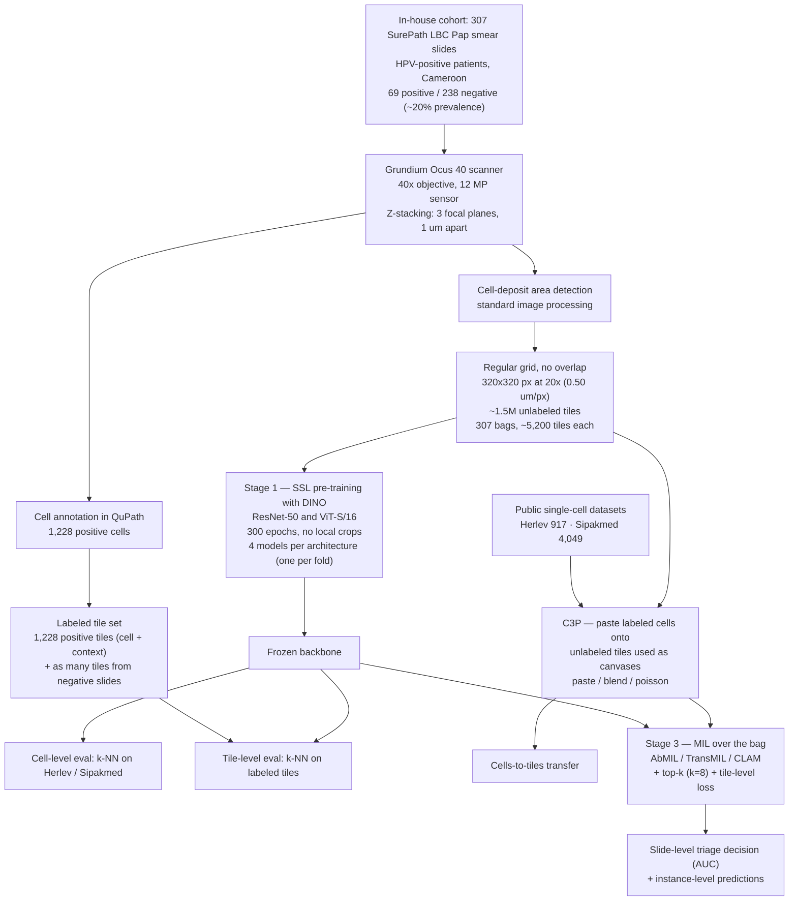

# Paper Notes — Self-supervised learning-based cervical cytology for the triage of HPV-positive women in resource-limited settings and low-data regime

> Stegmüller, T.; Abbet, C.; Bozorgtabar, B.; Clarke, H.; Petignat, P.; Vassilakos, P.; Thiran, J.-P.
> *Computers in Biology and Medicine* **2024**, 169, 107809. DOI: [10.1016/j.compbiomed.2023.107809](https://doi.org/10.1016/j.compbiomed.2023.107809) · PMID: 38113684
> EPFL · Hôpitaux Universitaires de Genève · CHUV, Lausanne
> <https://www.sciencedirect.com/science/article/pii/S001048252301274X> — open access, CC BY 4.0

---

## 1. Summary

### 1.1 Motivation

The problem is not accuracy in the abstract, but **deployability where there are no cytopathologists**:

- About **342,000 women died of cervical cancer in 2020**, most of them in developing countries where cytology-based screening programs are not available or affordable.
- The WHO recommends **HPV testing** as the primary screening method for women over 30 in low- and middle-income countries. But a single HPV test has **limited specificity** and leads to unnecessary workup and overtreatment, so a **triage strategy** is required — and cytology is the method generally proposed for triaging HPV-positive women.
- In low-resource settings, cytological triage is time-consuming and results are typically **unavailable on the same day as sample collection**. Loss to follow-up then makes this a seriously limiting problem, so rapid tests giving same-day results are preferred.
- The proposed answer is affordable digital imaging for remote cytologic diagnosis, enabling a **"test-triage-and-treat" (3T) approach** on-site during the same visit — and, further, deep-learning-assisted diagnosis to allow a **"same-day treatment"**.

The technical obstacle is annotation: "the main expenses are associated with the annotation process and the level of expertise it demands". Self-supervised learning is investigated precisely to exploit the abundance of **unlabeled images freely available from WSIs of Pap smear tests**.

### 1.2 Objective

> "we demonstrate that the abundance of unlabeled images that can be extracted from Pap smear test whole slide images presents a fertile ground for self-supervised learning methods, yielding performance improvements compared to off-the-shelf pre-trained models for various downstream tasks. In particular, we propose **C**ervical **C**ell **C**opy-**P**asting (C³P) as an effective augmentation method, which enables knowledge transfer from public and labeled single-cell datasets to unlabeled tiles."

The paper states four contributions explicitly:

1. Evaluate SSL-pretrained models for cytology across several downstream tasks, showing superior discriminability and generalizability of the learned representations.
2. Observe that representations learned on **public single-cell datasets** (Herlev, Sipakmed) **do not generalize to multi-cell images**, and propose **C³P** to mitigate it.
3. Observe that **MIL does not fully exploit the inherent properties of Pap smear cytology slides**, and introduce simple modifications — in particular, processing only the **top-k most suspicious tiles**.
4. Present a **medium-sized in-house LBC Pap smear dataset from HPV-positive women**, prepared with SurePath™, which shortens digitization time and yields smaller WSIs.

### 1.3 What makes the setting notable

- The cohort was collected in a genuinely resource-constrained setting: **the Pap tests were performed after a positive primary HPV test in Cameroon**.
- Acquisition uses **deliberately low-cost equipment** — the portable Grundium Ocus®40 scanner and the SurePath™ preparation, which "exists in a manual and low-cost version to further ease its adoption in a low-income setting".
- **All patients are HPV-positive**, so the negative class is not a healthy population: "negative slides typically portray signs of infections, which complicates the diagnosis".
- Evaluation is deliberately **low-data and frozen-backbone**: k-NN probing on frozen features, chosen "to limit the manual intervention to the minimum, thereby obtaining results that reflect the learned representations' quality".
- The label budget is tiny against the unlabeled pool: **1,228 annotated positive cells** versus **~1.5M unlabeled tiles**.

### 1.4 Availability

The article is **open access under CC BY 4.0**, but contains **no code availability statement and no dataset release statement**. Funding is acknowledged from the Personalized Health and Related Technologies (PHRT), Switzerland, grant 2021/344. The authors declare no competing interests, and declare the use of ChatGPT to improve readability during writing.

---

## 2. Pipeline



### 2.1 Data — in-house cohort

| Item | Value |
|---|---|
| Cohort | **307 Pap smear slides**; the Pap tests were performed after a **positive primary HPV test in Cameroon** |
| Class prevalence | ~20% cytology-positive — **69 positive / 238 negative** |
| Preparation | **SurePath™** liquid-based cytology; produces a **small cell-deposit area**, which shortens scanning time and reduces the size of the digitized slides |
| Scanner | **Grundium Ocus®40** — "a portable and affordable solution" |
| Sensor / objective | 12 megapixel image sensor, **40× objective** |
| Focus | **Z-stacking — 3 focal planes spaced by 1 μm** |
| Working magnification for tiles | **20× (0.50 μm/px)** |

Z-stacking is not incidental: the paper notes that cytological preparations frequently display thick cell groups, which "necessitates multiple scanning planes to allow proper analysis of the slides" and was historically a technological barrier to digital cytopathology.

### 2.2 Data — public single-cell datasets

Used twice: as **downstream benchmarks** for the learned representations, and as the **source of labeled cells** for C³P.

| Dataset | Total cells | Cytology-negative | Cytology-positive |
|---|---|---|---|
| **Herlev** — a liquid-based cytology Pap smear image dataset | 917 | **242**: superficial squamous epithelial (NS), intermediate squamous epithelial (NI), columnar epithelial (NC) | **675**: mild (LD), moderate (MD) and severe (SD) squamous non-keratinizing dysplasia, squamous cell carcinoma in situ (CIS) |
| **Sipakmed** — cervical squamous cells from Pap smear images | 4,049 | **2,411**: metaplastic (M), superficial-intermediate (SI), parabasal (P) | **1,638**: koilocytotic (K), dyskeratotic (D) |

The mismatch that motivates C³P: these datasets contain **isolated cells**, while the in-house task operates on **tiles containing multiple cells** in a real background.

### 2.3 Data — splits and label budget

A **stratified 4-fold split** partitions the slides into training, validation and test subsets. **The slide splits are common to all experiments, including the SSL pre-training** — so no test slide contributes to the self-supervised stage.

| Level | Data | Protocol |
|---|---|---|
| SSL pre-training | ~1.5M unlabeled tiles | 4 folds → **4 pre-trained models per architecture** |
| Cell-level evaluation | Herlev (917) / Sipakmed (4,049) | random **75/25** train–test |
| Tile-level evaluation | 1,228 positive tiles + as many sampled from negative slides | **75/25** train–test |
| Slide-level MIL | 307 bags (69 / 238) | of the 4 pre-training weights, **the first is used to determine hyperparameters and the remaining three for evaluation** |

### 2.4 Annotation

- Cell-level annotations were obtained with **QuPath**, giving **1,228 annotated positive cells**.
- Those annotations are used to build **two parallel datasets**: 1,228 **isolated positive cell images**, and 1,228 **320 × 320 px tiles containing the cell plus its context**, both at 20×.
- The negative half of the labeled tile set costs nothing: tiles are **randomly sampled from negative slides**, valid because a cytology-negative slide contains no positive cell.
- Everything else — the ~1.5M tiles — stays **unlabeled** and feeds only the self-supervised stage.

`not reported`: who performed the annotations, their expertise level, and the annotation time.

### 2.5 Preprocessing and tile extraction

1. **Cell-deposit area detection** — found with "standard image processing techniques". The SurePath™ deposit is small, which is what keeps the WSIs manageable.
2. **Tiling** — **320 × 320 px tiles at 20× (0.50 μm/px)**, sampled **on a regular grid without overlap**.
3. **Result** — approximately **1.5M images**, subdivided into **307 bags averaging 5,200 tiles each**. The bags are used for WSI-level classification; the individual tiles serve as the substrate for SSL pre-training.

Contrast with tile design choices elsewhere in this literature: the tile here is small and **without overlap**, and contextual aggregation is deferred to the MIL stage rather than being built into the tile.

### 2.6 Stage 1 — self-supervised pre-training (DINO)

| Item | Value |
|---|---|
| SSL framework | **DINO**, chosen for "its strong nearest neighbor classifier capability and excellent performance across different backbones" |
| Family | Self-distillation with a **Siamese teacher–student** pair; the student is trained to mimic the teacher's output distribution when both are fed distinct views of the same input |
| Collapse avoidance | Teacher updated by **EMA** of the student; teacher output entropy constrained by **sharpening and centering** |
| Backbones | **ResNet-50** and **ViT-S/16** |
| Input | 320 × 320 px tiles at 20× |
| Epochs | **300** per stratified split → 4 pre-trained models per architecture |
| Batch size | **256** (ResNet-50) / **192** (ViT-S/16) — set to fill the available GPU memory |
| Other hyperparameters | The recommended values from the official DINO repository |
| Supervised baselines compared against | ResNet-50: PyTorch ImageNet-1k weights. ViT-S/16: the weights of Touvron et al. (DeiT), **trained without distillation** |

**Deliberate deviation: no local crops.** DINO normally combines global and local views to distill local-to-global consistency. The authors drop the local crops because they "can result in ambiguous positive pairs for non-object-centric datasets, as is the case here" — a cytology tile is not a photograph of one centered object, so two small crops may show unrelated cells.

They flag the same concern more generally: most SSL methods rely on **spatial cropping**, which "is at risk of losing its information-preserving property on cytology images, partly due to the preparation of the slides that break long-range spatial dependencies".

### 2.7 Stage 2 — downstream evaluation protocol

Backbones are **frozen**; classification is done with a **k-NN classifier**, with k selected to maximize the weighted F₁. The stated reason is to "limit the manual intervention to the minimum, thereby obtaining results that reflect the learned representations' quality".

| Evaluation | Fitted on | Evaluated on | Repetitions |
|---|---|---|---|
| Cell-level | 75% of Herlev or Sipakmed | remaining 25% | 4 independent runs per pre-trained model → **16 runs** for SSL models, **4** for the supervised ones |
| Tile-level | 75% of the labeled tile set | remaining 25% | same scheme |

### 2.8 Cervical Cell Copy-Pasting (C³P)

The proposed augmentation. It transfers supervision from labeled *single-cell* datasets into the *tile* domain by synthesizing labeled tiles: an unlabeled in-house tile is the **canvas**, an annotated cell from Herlev or Sipakmed is pasted onto it, and **"the label of the pasted cell is attributed to the resulting pasted tile"**.

**Base procedure (`paste`)** — a two-step strategy:

> "(i) the pasting location of the cell is uniformly sampled among all the positions that would allow the cell to fit entirely in the tile, and (ii) the pixels of the tile in the pasting site are replaced by those of the cell."

The authors note this is closest to **CutMix**.

**Three pasting variants:**

| Variant | Definition | Rationale |
|---|---|---|
| `paste` | Hard pixel replacement at the pasting site. | Coarse; "does not produce natural-looking images", so the model may focus exclusively on the pasted regions during training and fail at test time. |
| `blend` | `x_blend = (1 − λ_paste)·x_cell + λ_paste·x_canvas`, with λ_paste ~ U[0,1]. | The transparency mimics the effect of **overlapping cells** and makes the border of the cell image less visible. Closest to **mixup**. |
| `poisson` | Poisson blending (Pérez et al., 2003): an optimization that computes the pasting-site pixels so as to **preserve the gradients of the source/cell image while matching the pixel intensities of the canvas at the boundaries**. | Fixes the main pitfall of `blend`, which "can only conceal the boundaries of the pasting site by concealing the cell". |

**Experimental setup for C³P** — 1,000 unlabeled tiles are used as canvases for each class (negative/positive), and labeled tiles are produced **online** by pasting a randomly selected labeled cell onto one of the canvases. **Positive cells are pasted upon unlabeled tiles from positive slides, and reciprocally negative cells onto tiles from negative slides.** A **linear classifier** is trained on top of the frozen pre-trained model and evaluated on the in-house labeled tiles. Only SSL-pretrained models are used in these experiments.

**Pasting probability — exploiting the asymmetry of the setting.** Applying C³P symmetrically is not optimal: "on one side, we know with certainty that tiles extracted from negative slides are all negatives; on the other side, little can be said with regard to the label of tiles extracted from positive slides". Systematically pasting therefore makes the model consider only the pasting site. By **not** always pasting on negative tiles, the model can "learn from real negative examples without the risk of feeding mislabeled samples". This is why a pasting probability is introduced on the negative side (§3.4).

**Use inside MIL training** — **hard negatives** (the 10 tiles with the highest positivity score in each negative slide) and **confident positives** (the top 10 in each positive slide) are collected throughout training and used as canvases, with **C³P-Poisson** and cells from both Herlev and Sipakmed.

### 2.9 Stage 3 — slide-level classification with MIL

Each slide is a **bag of ~5,200 tile embeddings** with only a slide-level label. In the binary MIL setting, with unknown instance labels `{y_i}`:

```text
Y = 1  iff  Σ_i y_i > 0
Y = 0  otherwise
```

**Setup:** three MIL methods — **AbMIL, TransMIL, CLAM** — using their official implementations, with **the positional encoding removed from TransMIL** (it brings little information here). Backbones stay **frozen**.

**Two proposed modifications:**

1. **Top-k selection.** The default setting is suboptimal for all method/backbone combinations, which the authors attribute to a particularity of Pap smear images: "features correlated with negativity are present almost everywhere, even in positive tiles, and features correlated with positivity are scarce", making the positive signal hard to surface in `z`. The fix is to process **only the top-k most suspicious tiles** of each slide, using the same backbone and classifier as the slide-level prediction. Because the backbone is frozen, tile representations can be **precomputed**, so identifying the top-k is not compute-intensive. **k = 8, batch size = 16.**
2. **Tile-level objective.**

```text
L = L_slide + λ_tile · L_tile          (6)
```

with `λ_tile` determined independently for each backbone/method combination (values used: 0.1, 0.5 or 1.0 — see §3.5). The tile labels come from the C³P-generated tiles.

### 2.10 Training configuration

| Item | Value |
|---|---|
| SSL objective | DINO self-distillation, unmodified |
| SSL epochs | 300 per fold |
| SSL batch size | 256 (ResNet-50) / 192 (ViT-S/16) |
| SSL hyperparameters | Official DINO repository defaults, except batch size and number of local crops |
| Downstream probe | k-NN on frozen embeddings (k tuned for weighted F₁); linear classifier for the C³P experiments |
| C³P canvases | 1,000 per class; pasting applied online |
| MIL | k = 8, batch size 16, frozen backbone, `L_slide + λ_tile·L_tile` |
| Framework | PyTorch (ImageNet weights taken from PyTorch for ResNet-50) |

`not reported`: learning rates, hardware/GPUs, total training time, inference cost per slide.

### 2.11 What the pipeline produces

A **slide-level triage decision** for an HPV-positive woman — does this patient need follow-up — plus, thanks to the top-k formulation and Eq. (5), **instance-level predictions** identifying which tiles drove the decision. The instance-level score is computed using the in-house positive tiles and randomly sampled tiles from negative slides, both extracted from the test tiles.

---

## 3. Final results

Cell-level and tile-level numbers are **F₁ scores (%)**; MIL numbers are **AUC (%)**. All are means over the repeated runs. Only the headline figures are reproduced here — the paper's Tables 1–9 carry the full class-wise breakdowns.

### 3.1 Representation quality

Weighted F₁ of a k-NN on **frozen** features, across the three classification benchmarks:

| Backbone | Pre-training | Herlev | Sipakmed | In-house tiles |
|---|---|---|---|---|
| ResNet-50 | ImageNet | 60.2 | 92.1 | 80.4 |
| ResNet-50 | **DINO** | 61.7 | 93.7 | **95.2 (+14.8)** |
| ViT-S/16 | ImageNet | 55.2 | 89.3 | 74.9 |
| ViT-S/16 | **DINO** | **62.6** | **94.1** | **96.5 (+21.6)** |

Two distinct regimes appear in this table. On the **external single-cell datasets**, in-domain SSL is *on par or slightly better* than ImageNet — a modest but notable result, given that ImageNet-1k supervision is the default choice and DINO here saw no labels at all. The gain is concentrated in the ViT-S/16 (+7.4 on Herlev); the ResNet-50 barely moves (+1.5).

On the **in-house tiles** — the actual target domain — the picture changes completely: +14.8 and +21.6 weighted F₁, with the backbone frozen and only a k-NN on top. The authors' framing is that the boost appears "when the pre-training and target datasets are well aligned". This is the central empirical claim of the paper: for this task the unlabeled tiles are worth more than ImageNet supervision.

One side observation they make is worth keeping: the fact that a *k-NN* works this well implies the SSL models "do not encode multiple cells as a single pattern", since a single collapsed pattern per tile would not allow positive tiles to match each other. They attribute this to the random cropping operation.

### 3.2 Cells-to-tiles transfer, and what C³P buys

Fitting a classifier on isolated cells (Herlev or Sipakmed) and testing it on in-house **tiles** fails outright: every ImageNet-pretrained model scores **exactly 0.0 F₁ on the positive class**, i.e. it never identifies a single positive tile. SSL pre-training alone lifts this only to 18–41, still unusable.

Adding C³P changes the regime. With the simplest `paste` variant the positive class reaches **65–83**, and with the final recipe (Poisson blending, pasting probability 0.5, tuned number of canvases) the gains over no-pasting run from **+10.7 to +43.3** F₁ depending on backbone and source dataset — the largest jump being ViT-S/16 with Sipakmed, which goes from 32.4 to 75.7 on the positive class. A t-SNE projection (Fig. 4) shows why: cells and real tiles occupy different regions of the feature space, and C³P-Poisson cells land next to the real positive tiles.

The three ablations, condensed:

- **Blending method** — `blend` is consistently *worse* than plain `paste` (λ either too low, giving unnatural images, or too high, making the cell barely visible). `poisson` matches `paste` in most combinations but is the only one that rescues ViT-S/16 + Sipakmed, so it is the variant selected.
- **Pasting probability** — pasting on *every* negative canvas is harmful, because the positive label becomes perfectly correlated with the pasting operation itself. Never pasting on negatives is also worse. **0.5 on negatives** is the compromise adopted.
- **Number of canvases** — helps up to **≈ 2,000**; beyond that the model overfits the pasted cells, which start recurring independently of their canvases.

### 3.3 Slide-level classification with MIL

This is where the paper is most candid about failure. With their **default implementations**, all three MIL methods sit between **49.9 and 64.3 slide-level AUC** — barely above chance, with standard deviations above ±11. Striking, given that the same frozen backbones reach ~95 F₁ at tile level. The diagnosis offered: in Pap smear slides "features correlated with negativity are present almost everywhere, even in positive tiles, and features correlated with positivity are scarce", so the positive signal is drowned in a weighted sum over ~5,200 instances.

The two proposed fixes recover **+11.7 to +19.5 AUC** across every method/backbone combination, landing the final models at **69.4–77.5**:

- **Top-k (k = 8)** helps everywhere except TransMIL, and also improves *tile-level* predictions — expected, since a slide representation built from 8 tiles stays much closer to the tile representations than one averaged over the whole bag. TransMIL's poor tile-level behaviour is offered as the reason it does not benefit.
- **The tile-level loss with C³P** is what rescues TransMIL (+14.0 and +19.5). C³P helps at slide level in every configuration except ViT-S/16 + AbMIL; the authors explain that an accurate top-k selection already enforces a tile-level objective implicitly, making C³P redundant precisely when the selection works well.
- **Variance collapses** alongside the gains (AbMIL + ViT-S/16: ±11.2 → ±2.9). Stability, not just mean performance.

Still, the best slide-level AUC is **77.5**, against ~96 F₁ at tile level. The gap between "recognizing an abnormal tile" and "deciding on a slide" is the unresolved part of the paper, and the conclusion says so.

### 3.4 Limitations stated by the authors

1. **Only DINO was tested**, chosen for its k-NN benchmark performance and backbone compatibility.
2. **Spatial cropping may be ill-suited to cytology** — the objective "may enforce consistency between semantically unrelated views". Since cropping is common to most self-distillation and contrastive methods, they expect the conclusion to generalize beyond DINO.
3. **Backbone scale** — larger backbones such as ViT-B/16 deserve investigation, but lighter ones "remain better suited in the low-data regime".
4. **Slide-level labels alone are not enough**, "particularly in our scenario where all samples are from HPV-positive women, which adds an additional layer of complexity".

---

[← Back to Week 2](README.md)
