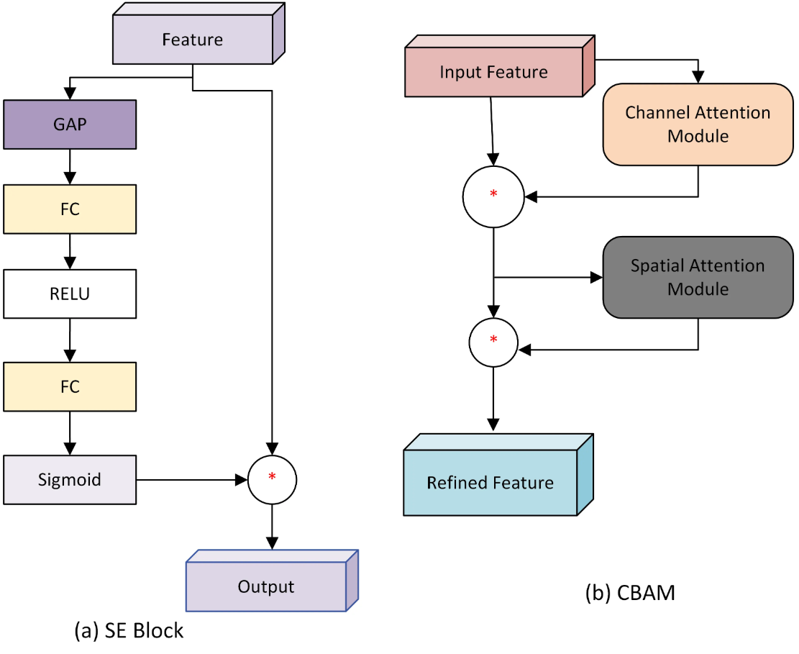
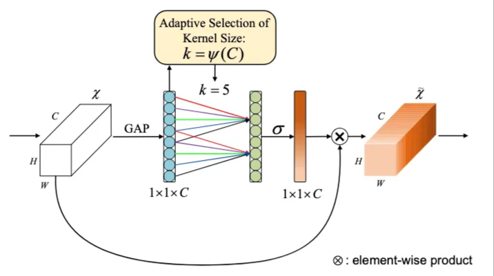
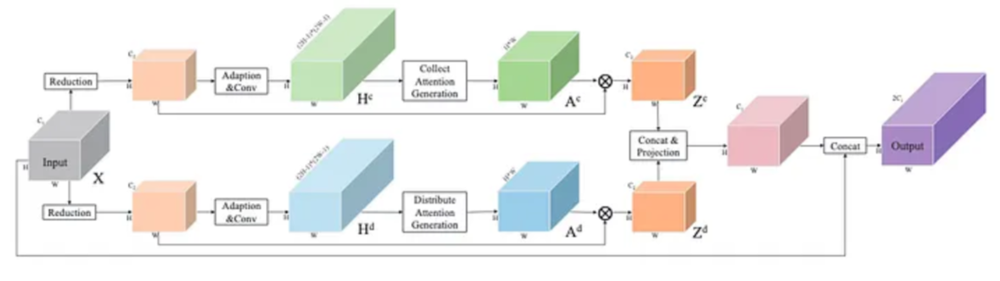
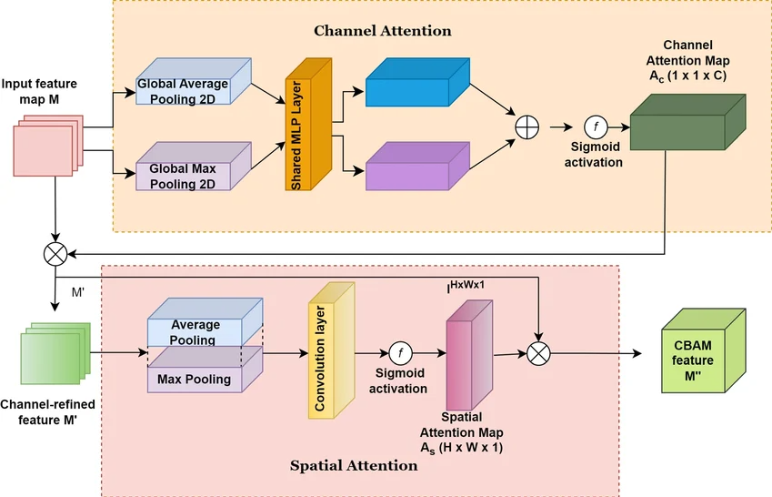

# Reading Notes — A Comprehensive Guide to Attention Mechanisms in CNNs

> A Comprehensive Guide to Attention Mechanisms in CNNs: From Intuition to Implementation (Simegnew Alaba), Medium, Aug 25, 2024
> <https://medium.com/@simonyihunie/a-comprehensive-guide-to-attention-mechanisms-in-cnns-from-intuition-to-implementation-7a40df01a118>

## 1. Context

Attention mechanisms are inspired by the human visual system, which selectively focuses on parts of the visual field while ignoring others. Applied to CNNs, they let the model **prioritise certain features or regions** of an image instead of processing all of them uniformly.

The problem being addressed is that a traditional CNN treats every part of the image as equally important.

| Challenge | What attention provides |
|---|---|
| **Selective focus** | Different regions contribute differently to the task; weighting them improves feature extraction |
| **Complex and noisy data** | Real images carry noise and irrelevant content; attention filters it out and makes the model more robust |
| **Long-range dependencies** | Convolutional filters capture local features only; attention can reach global context |
| **Interpretability** | Highlights which parts of the image drove the prediction |

Mechanically, attention is a weighting function applied over the feature maps, in four steps:

```text
feature extraction → attention calculation → feature recalibration → classification / further processing
```

The attention map assigns weights to parts of the feature maps according to their importance, and the original feature maps are multiplied by it, enhancing the important components and suppressing the rest.

The mechanisms are categorised by **what** they weight:

| Type | Weights | Modules covered here |
|---|---|---|
| **Channel attention** | importance of each feature channel | SE, ECA-Net |
| **Spatial attention** | importance of each spatial region | PSA |
| **Hybrid attention** | combines two or more mechanisms | CBAM |

**Where it is useful:** Image classification (complex scenes with multiple objects), object detection (localisation by emphasising relevant regions), image segmentation (refining masks around boundaries), and medical imaging (attention helps the model concentrate on tumours or abnormalities while ignoring healthy tissue).

---

## 2. Squeeze-and-Excitation (SE) — channel attention



| Step | Operation | Dimension |
|---|---|---|
| Input `X` | — | `C × H × W` |
| **Squeeze** | Global Average Pooling over `H × W` | `1 × 1 × C` (channel descriptor) |
| **Excitation** — FC₁ | reduces channels by ratio `r` (typically 16) | `1 × 1 × C/r` |
| ReLU | non-linearity over the channel dependencies | `1 × 1 × C/r` |
| **Excitation** — FC₂ | restores the original channel count | `1 × 1 × C` |
| Sigmoid | squashes weights into `[0, 1]` | `1 × 1 × C` |
| **Rescale** | channel-wise multiplication with `X` | `C × H × W` |

## 3. ECA-Net — efficient channel attention



| Step | Operation | Dimension |
|---|---|---|
| Input `X` | — | `C × H × W` |
| Global Average Pooling | averages each channel over `H × W` | `1 × 1 × C` |
| Adaptive kernel | `k = ψ(C)`, a function of the channel dimension (e.g. `k = 5`) | scalar |
| **1D convolution** | kernel `k` applied along the channel dimension, capturing channel-wise dependencies | `1 × 1 × C` |
| Sigmoid `σ` | generates one attention weight per channel | `1 × 1 × C` |
| Element-wise multiplication | applied back to `X` | `C × H × W` (refined map `Z̄`) |

## 4. PSANet (PSA module) — point-wise spatial attention



| Step | Operation | Dimension |
|---|---|---|
| Input `X` | — | `C₁ × H × W` |
| **Reduction** | compresses `C₁ → C₂` to make the attention computation cheaper | `C₂ × H × W` |
| **Adaptation & Convolution** | two parallel streams: `Hᶜ` (collect) and `Hᵈ` (distribute) | `(2H+1) × (2W+1) × C₂` each |
| **Collect Attention Generation** | `Aᶜ` — how much attention each point should *collect* from the others | `H × W × (2H+1) × (2W+1)` |
| **Distribute Attention Generation** | `Aᵈ` — how much attention each point should *distribute* to the others | same as `Aᶜ` |
| Element-wise multiplication | `Hᶜ ⊗ Aᶜ → Zᶜ` and `Hᵈ ⊗ Aᵈ → Zᵈ` | `C₂ × H × W` each |
| **Concat & Projection** | concatenates `Zᶜ` and `Zᵈ` on the channel axis, then projects back to `C₂` | `C₂ × H × W` |
| **Final concatenation** | with the reduced input `X` | `2C₂ × H × W` |

## 5. CBAM — hybrid attention



**Channel Attention Module**

| Step | Operation | Dimension |
|---|---|---|
| Input | — | `C × H × W` |
| GAP and GMP | computed separately, giving two channel descriptors | `1 × 1 × C` each |
| **Shared MLP** | same MLP applied to both, with reduction ratio `r` (`C → C/r → C`) | `1 × 1 × C` each |
| Element-wise sum | merges the two branches | `1 × 1 × C` |
| Sigmoid | channel-wise attention weights | `1 × 1 × C` |
| Rescale | channel-wise multiplication | `C × H × W` |

**Spatial Attention Module**

| Step | Operation | Dimension |
|---|---|---|
| Input | output refined by the channel module | `C × H × W` |
| Average and max pooling | applied **across the channel dimension**, giving two 2D maps | `1 × H × W` each |
| Concatenation | on the channel axis, forming the combined descriptor | `2 × H × W` |
| **Convolution** | usually a `7 × 7` kernel, reducing `2 → 1` channel | `1 × H × W` |
| Sigmoid | spatial attention weights | `1 × H × W` |
| Refined feature | broadcast multiplication with the input | `C × H × W` |

---
