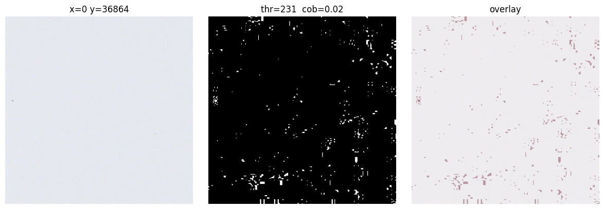
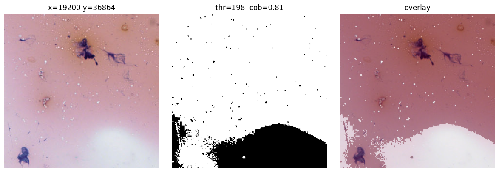
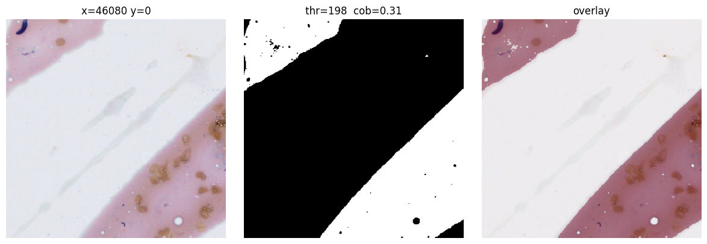
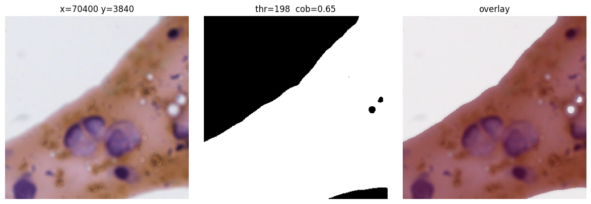

# September — Week 3


## Overview

| # | Activity | Output | Hours |
|---|---|---|---|
| 1 | Reading — SimCLR, contrastive self-supervised learning | [SimCLR.md](SimCLR.md) | 3 h |
| 2 | Reading — attention mechanisms in CNNs (SE, ECA, PSA, CBAM) | [AttentionCNN.md](AttentionCNN.md) | 3 h |
| 3 | Tile extraction practice with OpenSlide | [TileExtraction.ipynb](TileExtraction.ipynb) | 5 h |

---

### 1. Reading — SimCLR — 3 h

*A Simple Framework for Contrastive Learning of Visual Representations* (Chen et al., ICML 2020), read through Sik-Ho Tsang's review.

Main points:

- Learns representations **without labels**, by maximizing agreement between two augmented views of the same image (**positive pair**); all the other views in the batch are the negatives.
- Pipeline: augmentation → base encoder `f(·)` (ResNet) → projection head `g(·)` (MLP) → **NT-Xent** loss on the projected vectors. After pretraining, `g(·)` is discarded and the encoder output is what is used downstream.
- The **composition of augmentations** matters (random crop + color distortion), the **nonlinear projection head** improves the representation, and larger batches / longer training help, because the negatives come from the batch itself.

### 2. Reading — attention mechanisms in CNNs — 3 h

*A Comprehensive Guide to Attention Mechanisms in CNNs* (Simegnew Alaba, Medium).

Main points:

- A plain CNN treats every region and every channel as equally important; attention **reweights the feature maps** before they are passed on (`feature extraction → attention calculation → feature recalibration → classification`).
- **Channel attention** (SE, ECA-Net): describe each channel with global pooling and produce one weight per channel — SE uses two FC layers with a reduction ratio `r`, ECA replaces them by a single 1D convolution over the channels.
- **Spatial attention** (PSA): weights *where* in the image the signal is, with collect/distribute attention maps.
- **Hybrid** (CBAM): channel module followed by spatial module.

### 3. Tile extraction practice with OpenSlide — 5 h

The goal here was **familiarization with the commands needed to manipulate a slide (WSI) in order to perform tile extraction**.

#### 3.1 Pyramid levels and slide properties

A WSI is not a single image: it is stored as a **pyramid** of progressively downsampled copies of the same slide.

- **Level 0** is the full-resolution image, at the magnification the scanner used (**40×** in this slide, `0.23 µm/px`).
- Each following level halves the linear resolution (downsample `2, 4, 8, …`), so level 1 is 20×, level 2 is 10×, and so on.
- The **coordinates are always given in level-0 reference**, whatever level is being read from, so when scanning with a fixed stride, the stride has to be multiplied by the level's downsample factor.

#### 3.2 Main commands

| Command | What it returns |
|---|---|
| `openslide.OpenSlide(path)` | The slide object (`.ndpi` here, Hamamatsu) |
| `s.dimensions` | Width and height of **level 0**, in pixels |
| `s.level_count` | How many levels the pyramid has |
| `s.level_downsamples` | The downsample factor of each level, relative to level 0 |
| `s.level_dimensions` | The `(width, height)` of each level |
| `s.properties[...]` | Scanner metadata — `objective-power`, `vendor`, `mpp-x`, `mpp-y` |
| `s.get_best_level_for_downsample(d)` | The most suitable level to read at a given downsample factor |
| `s.read_region((x, y), level, (w, h))` | A `PIL` image of that region — `(x, y)` in **level-0 coordinates**, `(w, h)` in pixels **of the chosen level** |

#### 3.3 Otsu — separating slide background from cellular content

Most of a cytology slide is empty glass, so the tiles have to be filtered before anything else.

```python
gray = np.asarray(img.convert("L"))   # 8-bit grayscale: 0 = black … 255 = white
thr  = threshold_otsu(gray)           # the threshold chosen by Otsu, e.g. 198
mask = gray < thr                     # boolean array, True where the pixel is darker than thr
```

The mask is an array of `True`/`False` with the same shape as the tile: `True` where the pixel is **darker** than the threshold, i.e. stained material. Displayed with `cmap="gray"`, **`True` becomes white (cellular content) and `False` becomes black (slide background)**.

**Attempt 1 — Otsu computed per tile** (does not work):



**Attempt 2 — one Otsu threshold for the whole slide**:



Now there is a clear boundary: `thr = 198` for the whole slide, the glass background comes out **black** and the cellular content comes out **white**, with the mask following the real edge of the smear.

#### 3.4 Coverage threshold — which tiles to keep

With a mask that is trustworthy, selecting tiles becomes a question of **how much white the mask must have for the tile to be considered valid**.

**≥ 30% white:**



It does let material in, but tiles like this one (`cob = 0.31`) are mostly the edge of the smear, with a large empty diagonal and few cells actually in the field.

**≥ 60% white:**



At `cob = 0.65` the tiles are visibly denser, with whole cells and nuclei in the field.

This part is **investigation**: the coverage threshold has to be varied and evaluated against the tile size and the amount of tiles it yields per slide, to find the point that keeps informative tiles without filling the dataset with background.
