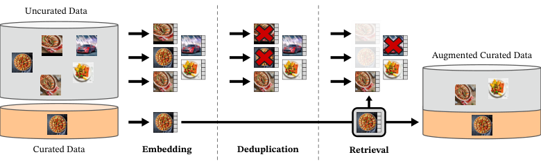

# Paper Notes — DINOv2: Learning Robust Visual Features without Supervision

> Oquab, M.; Darcet, T.; Moutakanni, T.; Vo, H.; Szafraniec, M.; et al. (Meta AI Research)
> arXiv:2304.07193, April 2023 (last revised February 2024)
> <https://arxiv.org/html/2304.07193v2>

## 1. Context

The goal is **general-purpose visual features** that work across image distributions and tasks **without any finetuning** — usable out of the box by a linear classifier or a k-NN on top of a frozen backbone.

Three contributions follow from it:

| # | Contribution |
|---|---|
| 1 | An **automatic curation pipeline** that builds a diverse curated dataset (LVD-142M) without metadata or external supervision |
| 2 | **Technical improvements** that accelerate and stabilise discriminative SSL at scale |
| 3 | A **ViT-g/14 with 1B parameters**, distilled into smaller models that outperform training them from scratch |

---

## 2. Data — the LVD-142M pipeline

| Stage | Operation |
|---|---|
| **Sources — curated** | ImageNet-22k, ImageNet-1k train split, Google Landmarks, and fine-grained datasets |
| **Sources — uncurated** | A public repository of crawled web data, giving **1.2B unique images** after safety filtering, PCA deduplication, NSFW filtering and face blurring |
| **Embedding** | A self-supervised **ViT-H/16** pretrained on ImageNet-22k computes the embeddings |
| **Deduplication** | Copy-detection removes near-duplicates, **including duplicates of benchmark test and validation sets** |
| **Retrieval** | **k-NN with k = 4** per query for large curated sources; **cluster-based sampling** of M images for small sources. Distance is cosine similarity |
| **Result** | **LVD-142M** — 142 million images |

---

## 3. Discriminative self-supervised pre-training

A **student–teacher** pair in which the student is updated by backpropagation and the teacher by **exponential moving average** of the student.

| Component | What it does |
|---|---|
| **Image-level objective (DINO)** | Cross-entropy between student and teacher **class tokens**. Loss: `L_DINO = −Σ p_t log p_s` |
| **Patch-level objective (iBOT)** | Random patch **masking applied to the student input only**. Loss: `L_iBOT = −Σ_i p_ti log p_si` |
| **Untying head weights** | Separate MLPs for the DINO and iBOT losses |
| **Sinkhorn–Knopp centering** | Replaces the softmax-centering of the teacher branch with the SwAV batch normalisation |
| **KoLeo regulariser** | Encourages a **uniform spread of features within a batch**: `L_koleo = −(1/n) Σ_i log(d_n,i)` |
| **High-resolution training** | Resolution is raised to **518 × 518 only for a short period at the end** of pre-training |

---

## 4. Efficient implementation

| Technique | Effect |
|---|---|
| **FlashAttention** | Custom variant optimising memory and speed in the self-attention layers |
| **Sequence packing** | Global crops (224) and local crops (98) tokenise to different sequence lengths |
| **Efficient stochastic depth** | Skips the computation of dropped residuals |
| **FSDP** | Cuts communication cost by **~50%** against standard DDP |
| **Model distillation** | Smaller models are distilled from ViT-g |

 

| Model | Parameters | Embedding dim | Heads |
|---|---|---|---|
| ViT-S/14 | — | 384 | 6 |
| ViT-B/14 | ~86M | 768 | 12 |
| ViT-L/14 | ~300M | 1024 | 16 |
| ViT-g/14 | ~1.1B | 1536 | 24 |

---

## 5. Ablations

| Study | Conclusion |
|---|---|
| **Technical modifications** | Adding the components to an iBOT baseline raises ImageNet k-NN from **72.9% to 82.0%**. KoLeo alone accounts for **+2.3%**, batch size 3k for **+1.2%** |
| **Pretraining data** | LVD-142M beats ImageNet-22k on most benchmarks, the exception being ImageNet-1k itself |
| **Model and data scaling** | Larger models benefit more from larger datasets |
| **Loss components** | KoLeo improves instance retrieval by **over 8%** |
| **Knowledge distillation** | A distilled ViT-L/14 beats a scratch-trained ViT-L on **all 12 benchmarks** |
| **Resolution** | High resolution for only **10k iterations** at the end matches full high-resolution training at **1/3 of the compute** |

---

## 6. Results

Evaluation uses a **frozen backbone** with a linear classifier or k-NN, **without finetuning**.

| Benchmark | DINOv2 ViT-g/14 | Comparison |
|---|---|---|
| ImageNet-1k, linear | **86.5%** | +0.3 over OpenCLIP ViT-G/14; +4.2 over iBOT ViT-L/16 (82.3%) |
| ImageNet-1k, k-NN | 83.5% | — |
| ADE-20k, linear | **49.0 mIoU** | OpenCLIP ViT-G/14: 39.3 (53.0 with multiscale) |
| NYUd depth, RMSE (lower is better) | **0.344** | OpenCLIP ViT-G/14: 0.414 (~17% better) |
| Oxford-Hard, mAP | **52.3** | iBOT: 12.7 |

---
